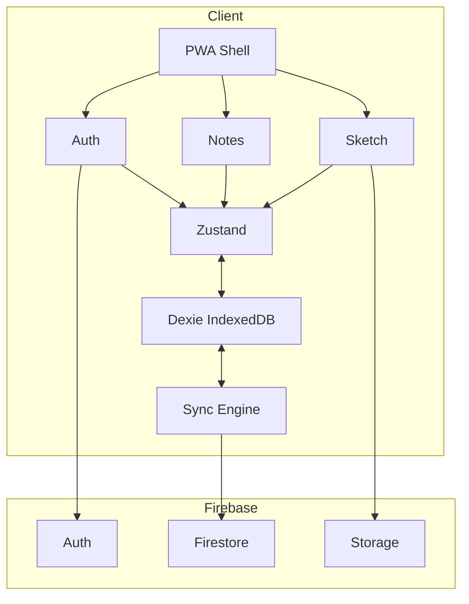
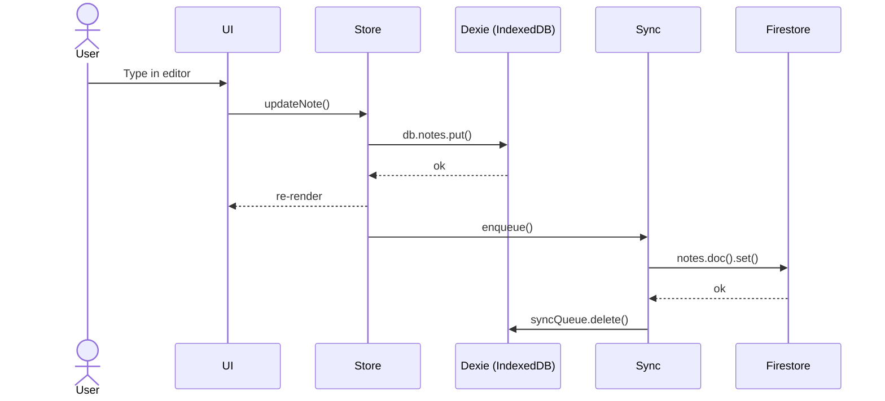
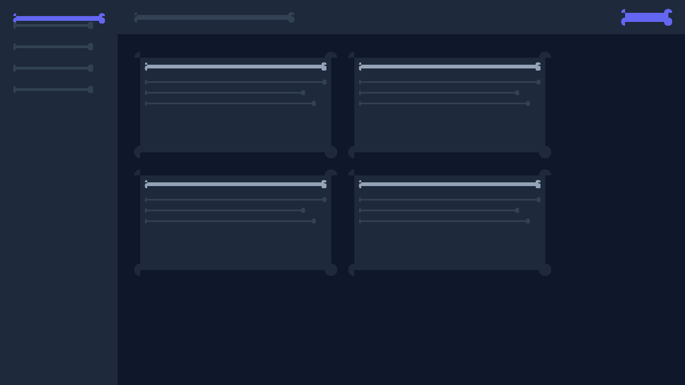
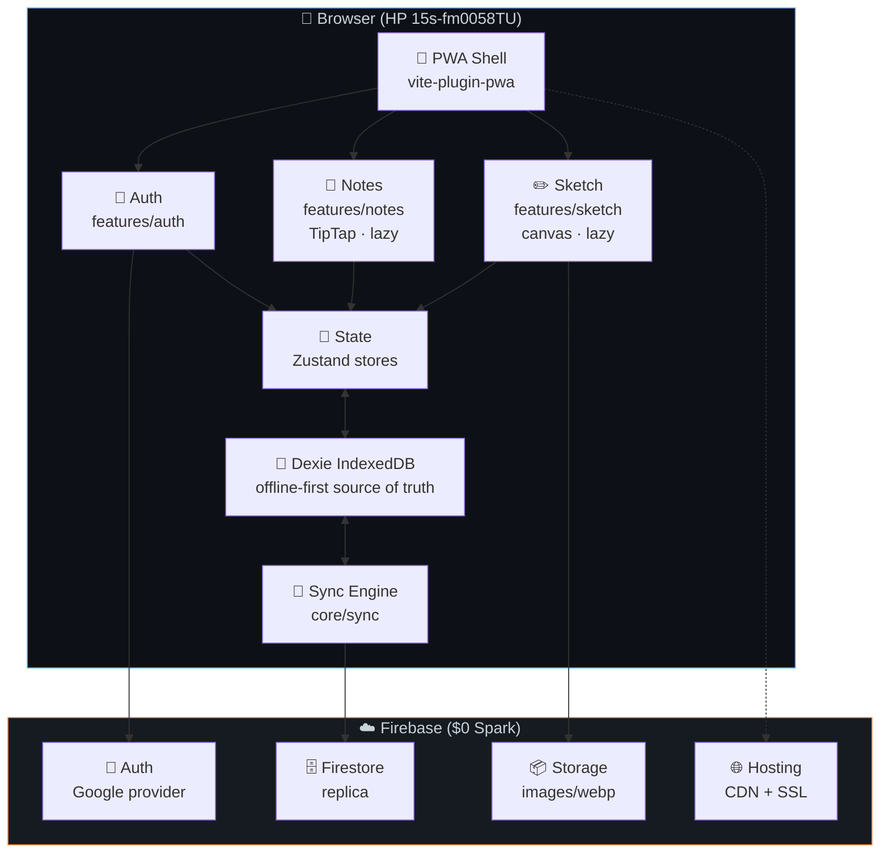
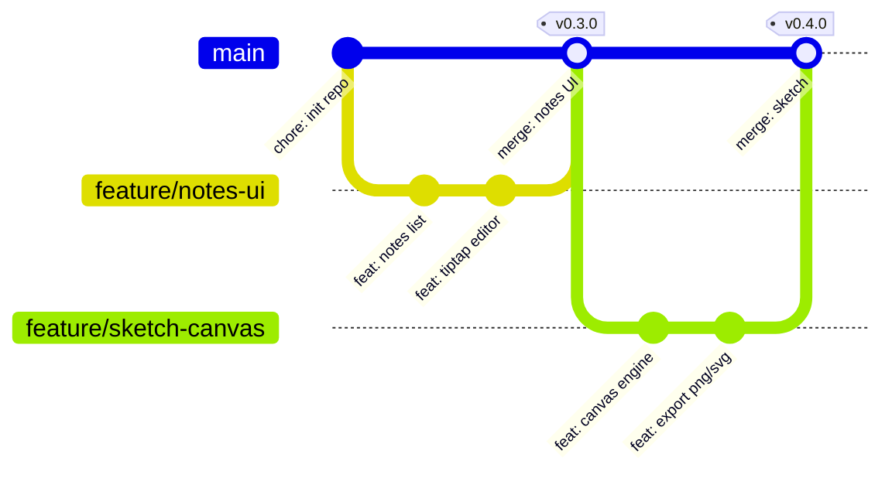

# Inkify — Notes & Sketch PWA

[](LICENSE)
[](https://www.typescriptlang.org/)
[](https://react.dev/)
[](https://vitejs.dev/)
[](https://web.dev/progressive-web-apps/)
[](https://firebase.google.com/)

Offline-first notes & sketch PWA with Google login. Built with React, Vite, Tailwind, Firebase.

## Features

- Google Sign-In
- Rich text notes (TipTap editor)
- Freehand sketching (canvas + perfect-freehand)
- Offline-first (IndexedDB via Dexie, syncs when online)
- Installable PWA
- Dark / light theme

## Tech Stack

| Layer | Tech |
|---|---|
| Frontend | Vite 6 + React 18 + TypeScript |
| Styling | Tailwind CSS v4 |
| PWA | vite-plugin-pwa + Workbox |
| Notes | TipTap (ProseMirror) |
| Sketch | Custom canvas + perfect-freehand |
| Local DB | Dexie.js (IndexedDB) |
| State | Zustand |
| Cloud | Firebase (Auth, Firestore, Storage, Hosting) |
| Validation | Zod |

## Architecture



## Data Flow



## Getting Started

### Prerequisites

- Node.js ≥ 20
- npm ≥ 10
- A Firebase project (free Spark tier)

### Setup

```bash
git clone git@github.com:jaiswalkanishk07/inkified.git
cd inkified
npm install
cp .env.example .env.local
# Fill in your Firebase keys in .env.local
npm run dev
```

### Firebase Setup

1. Create a project at [Firebase Console](https://console.firebase.google.com/)
2. Enable **Authentication → Google** sign-in
3. Enable **Cloud Firestore** and **Storage**
4. Copy your web app config into `.env.local`

### Environment Variables

```env
VITE_FIREBASE_API_KEY=...
VITE_FIREBASE_AUTH_DOMAIN=...
VITE_FIREBASE_PROJECT_ID=...
VITE_FIREBASE_STORAGE_BUCKET=...
VITE_FIREBASE_MESSAGING_SENDER_ID=...
VITE_FIREBASE_APP_ID=...
VITE_FIREBASE_MEASUREMENT_ID=...
VITE_RECAPTCHA_V3_SITE_KEY=...
```

## Scripts

```bash
npm run dev          # Dev server
npm run build        # Production build
npm run preview      # Preview build
npm run lint         # Lint
npm run typecheck    # Type check
npm run test         # Unit tests
npm run test:e2e     # E2E tests
```

## Project Structure

```
src/
├── app/              # App shell, router, entry point
├── features/
│   ├── auth/         # Google login, protected routes
│   ├── notes/        # Notes list & editor
│   └── sketch/       # Canvas sketching
├── core/
│   ├── firebase/     # Firebase config
│   ├── db/           # Dexie schema
│   └── sync/         # Offline sync engine
├── shared/
│   ├── components/   # Button, Modal, Toast, etc.
│   ├── hooks/        # Shared hooks
│   ├── styles/       # Tailwind entry
│   └── utils/        # Helpers
└── types/            # Shared domain types
```

## License

MIT


<div align="center">

<!-- Shields.io badges — flat-square for clean enterprise look -->
[](LICENSE)
[](CONTRIBUTING.md)
[](https://www.typescriptlang.org/)
[](https://react.dev/)
[](https://vitejs.dev/)
[](https://web.dev/progressive-web-apps/)
[](https://firebase.google.com/)
[](https://tailwindcss.com/)

<!-- Animated title via HTML to keep it crisp on all renderers -->
<h1> Inkify</h1>

**A lightning-fast, offline-first Progressive Web App for rich notes and freehand sketching — tuned line-by-line for the HP 15s-fm0058TU and every budget thin-and-light like it.**

<sub>Built with ❤️ for 8GB RAM · shared iGPU · mouse & keyboard · $0 infrastructure</sub>

**[📥 Install PWA](https://inkify.web.app)** · **[📖 Docs](docs/)** · **[🐛 Report Bug](https://github.com/jaiswalkanishk07/inkified/issues/new)** · **[✨ Request Feature](https://github.com/jaiswalkanishk07/inkified/issues/new)**



</div>

---

## 📋 Table of Contents

- [Why Inkify?](#-why-inkify)
- [Target Hardware](#-target-hardware)
- [Tech Stack](#-tech-stack)
- [Architecture](#-architecture)
- [Data Flow](#-data-flow)
- [Features](#-features)
- [Getting Started](#-getting-started)
- [Development](#-development)
- [Build & Deployment](#-build--deployment)
- [Performance Budgets](#-performance-budgets)
- [Security](#-security)
- [Contributing](#-contributing)
- [Roadmap](#-roadmap)
- [License](#-license)
- [Acknowledgements](#-acknowledgements)


---

## 🎯 Why Inkify?

Existing note-taking apps treat every laptop like it's an M3 MacBook. Inkify is **engineered in reverse**: start from the constraint (a 2024 budget HP 15s with an i3-N305, shared Intel UHD graphics, 8GB RAM, no touchscreen, Windows 11) and build **up** until it feels premium there. If it flies on fm0058TU, it flies everywhere.

| Pain point | How Inkify solves it |
|---|---|
| Heavy SPAs that thrash 8GB RAM | JS gzipped budget **≤180KB** first load; lazy-loaded routes; virtualized lists |
| Shared iGPU melts under canvas apps | Dual-layer canvas, capped DPR, offscreen compositing, zero `shadowBlur` |
| Can't take notes on a plane | Full offline-first: Dexie IndexedDB source of truth, Firestore as replica |
| Enterprise wants Google login, zero trust | Firebase Auth Google provider, Security Rules, App Check, CSP headers |
| "Free" stops at 100 users | **$0/mo** at Spark tier: 50K MAU, 50K reads/day, 5 GB storage, custom SSL |
| Notetaking + sketching = two apps | **One app, two modes** — flip between Markdown and canvas in seconds |

---

## 🖥 Target Hardware

> Primary target — every decision traces back here.

| Spec | HP 15s-fm0058TU | Impact on Inkify |
|---|---|---|
| **CPU** | Intel Core i3-N305 (Alder Lake-N, 8c/8t, 1.8–3.8 GHz) | Weak single-thread → keep frames ≤16ms, chunk work with rAF + workers |
| **RAM** | 8 GB LPDDR4x-3200 (shared) | App memory ≤150MB, lazy-load heavy routes |
| **Graphics** | Intel UHD 32EU (shared VRAM) | No WebGL for core UX; CSS `transform` for GPU compositing on canvas |
| **Display** | 15.6" FHD 1920×1080, anti-glare, **non-touch** | Mouse + touchpad UI, large hit targets ≥32px, full keyboard shortcuts |
| **Storage** | 512 GB NVMe | IndexedDB budget ~300MB; images compressed to WebP ≤500KB |
| **OS / Browser** | Windows 11 Home, Chrome / Edge (latest) | Full PWA APIs, File System Access, Background Sync |
| **Network** | Wi-Fi 5 (802.11ac) | Graceful offline; sync queue with backoff on reconnect |

*Identical optimization targets: ASUS Vivobook 15, Lenovo IdeaPad 3, Acer Aspire 5, Dell Inspiron 15 — any 8GB/iGPU/1080p budget machine.*

---

## ⚡ Tech Stack

<div align="center">

```
Frontend        → Vite 6 + React 18 + TypeScript 5
Styling         → Tailwind CSS v4 (purged to ~12KB)
PWA shell       → vite-plugin-pwa + Workbox 7
Notes editor    → TipTap (ProseMirror) — lazy-loaded
Sketch engine   → Custom <canvas> + perfect-freehand
Local DB        → Dexie.js (IndexedDB) — offline-first source of truth
State           → Zustand (~2KB)
Cloud auth/DB   → Firebase Spark (Auth, Firestore, Storage, Hosting) — $0
Validation      → Zod
Testing         → Vitest + Testing Library + Playwright
CI/CD           → GitHub Actions + Firebase Hosting
Linting         → ESLint + Prettier + a11y plugin
```

</div>

### Why these specific tools?

- **Vite over Next.js**: No SSR overhead for a fully-client PWA. 3× faster HMR, smaller runtime.
- **TipTap over Slate/Lexical**: Tree-shakable Markdown support, smallest editor that meets enterprise needs.
- **Custom canvas over tldraw/Excalidraw**: tldraw ships ~1.2MB, Excalidraw ~800KB — unusable on target iGPU. Custom + `perfect-freehand` = **~3 KB** for the stroke engine.
- **Dexie over raw IndexedDB**: `useLiveQuery()` reactivity + ergonomic API + mature quota handling.
- **Firebase Spark over Supabase Free**: Supabase pauses free projects after 7 days (unacceptable for production notes). Firebase Spark never pauses, 50K MAU, no card.
---

## 🏗 Architecture

### High-level system



### Feature-first directory tree

```mermaid
flowchart LR
    src["📁 src/"]
    src --> app["app/<br/>App · Router · Providers"]
    src --> features["features/"]
    src --> core["core/"]
    src --> shared["shared/"]
    src --> types["types/"]

    features --> auth["auth/<br/>LoginScreen · ProtectedRoute"]
    features --> notes["notes/<br/>List · Editor · Search"]
    features --> sketch["sketch/<br/>Canvas · Toolbar · Export"]

    core --> firebase["firebase/<br/>config"]
    core --> db["db/"]
    core --> sync["sync/<br/>syncEngine · queue"]
    core --> pwa["pwa/<br/>usePWAInstall · SW types"]

    shared --> components["components/<br/>Button · Modal · Toast"]
    shared --> hooks["hooks/<br/>useDebounce · useMediaQuery"]
    shared --> utils["utils/<br/>format · validate · compress"]
---

## 🔄 Data Flow

### Offline-first read/write (happy path — online)

```mermaid
sequenceDiagram
    actor User
    participant UI as React UI
    participant Store as Zustand Store
    participant Dexie as Dexie (IndexedDB)
    participant Sync as Sync Engine
    participant FS as Firestore

    User->>UI: Type in editor (debounced 800ms)
    UI->>Store: updateNote(id, partial)
    Store->>Dexie: db.notes.put()  [local commit]
    Dexie-->>Store: ok (instant)
    Store-->>UI: re-render (useLiveQuery)
    Store->>Sync: enqueue(note, 'upsert')
    Sync->>FS: notes.doc(id).set()  [replica]
    FS-->>Sync: ok
    Sync->>Dexie: syncQueue.delete(opId)

    Note over Dexie,FS: Local commit is synchronous — <br/>UI never waits on network. <br/>Firestore sync is eventual.
```

### Offline-first write (airplane mode → reconnect)

```mermaid
sequenceDiagram
    actor User
    participant UI
    participant Store
    participant Dexie
    participant Sync
    participant FS

    Note over UI,FS: AIRPLANE MODE — network unreachable

    User->>UI: Edit 5 notes, draw 1 sketch
    UI->>Store: updateNote x5, saveSketch
    Store->>Dexie: db.notes.put() x5
    Store->>Dexie: db.syncQueue.bulkAdd(ops)
    Store-->>UI: "Saved locally" toast

    Note over UI,FS: RECONNECT — 'online' event fires

    Sync->>Dexie: flush syncQueue (exponential backoff)
---

## ✨ Features

### 📝 Notes

- [x] Rich Markdown editor (TipTap) — headings, bold, italic, code, lists, quotes, links, horizontal rule
- [x] Live autosave (debounced) — instant local, eventual cloud
- [x] Full-text search (title + body) with debounce
- [x] Tags, pin, archive, trash (soft-delete with restore)
- [x] Keyboard-first navigation (Cmd+K command palette, / to search)
- [x] Import / export Markdown files
- [x] Offline creation & editing

### ✏️ Sketch

- [x] Freehand pen with pressure-sensitive strokes (`perfect-freehand`)
- [x] Eraser, line, rectangle, ellipse, text tools
- [x] Color palette + custom picker
- [x] Adjustable brush size & opacity
- [x] Infinite pan & zoom (CSS-transform, GPU-composited)
- [x] Undo / redo (50-step history, RAM-bounded)
- [x] Export to PNG (≤500KB WebP) and SVG
- [x] Offline sketch save + sync
- [x] Mouse + touchpad optimized (no touchscreen required)

### 🔐 Auth & Security

- [x] Google Sign-In (enterprise SSO-ready)
- [x] Session persistence across restarts
- [x] Firestore Security Rules (owner-scoped)
- [x] Firebase Storage rules (owner metadata, 5MB cap)
- [x] App Check (reCAPTCHA v3)
- [x] Strict CSP headers
- [x] Client-side rate limiting on writes

### 🚀 PWA

- [x] Installable on desktop & mobile
- [x] Offline app shell + `/offline.html` fallback
---

## 🚀 Getting Started

### Prerequisites

| Tool | Version | Why |
|---|---|---|
| Node.js | ≥ 20.x LTS | Vite 6 requirement |
| npm | ≥ 10.x | Built-in |
| Git | ≥ 2.40 | Conventional Commits + branching |
| Chrome / Edge | latest | PWA APIs, File System Access |

### Installation

```bash
# 1. Clone
git clone git@github.com:jaiswalkanishk07/inkified.git
cd inkified

# 2. Install (clean — takes ~30s on target machine)
npm install

# 3. Copy env template — fill in YOUR Firebase keys
cp .env.example .env.local
# Edit .env.local with values from Firebase Console → Project Settings → Your App

# 4. Run dev server
npm run dev
# → http://localhost:5173
```

### Firebase setup (5 minutes, $0)

1. Go to [Firebase Console](https://console.firebase.google.com/) → **Create project** (e.g., `inkify-prod`).
2. Enable **Authentication** → **Sign-in method** → **Google** (enable, add support email).
3. Enable **Cloud Firestore** → start in **production mode** → pick region closest to users.
4. Enable **Storage** → same region.
5. Project Settings → **Your apps** → **Web app** (`</>`) → copy config into `.env.local`.
6. Set up **App Check** → reCAPTCHA v3 site key → add to `.env.local`.
7. Deploy Security Rules & Storage rules:
   ```bash
   firebase login
   firebase use inkify-prod
   firebase deploy --only firestore:rules,storage
   ```
8. See [`docs/FIREBASE_SETUP.md`](docs/FIREBASE_SETUP.md) for the complete walkthrough with screenshots.

### Environment variables

```env
# .env.local — NEVER commit this file
VITE_FIREBASE_API_KEY=AIza...
VITE_FIREBASE_AUTH_DOMAIN=inkify-prod.firebaseapp.com
VITE_FIREBASE_PROJECT_ID=inkify-prod
VITE_FIREBASE_STORAGE_BUCKET=inkify-prod.appspot.com
VITE_FIREBASE_MESSAGING_SENDER_ID=...
VITE_FIREBASE_APP_ID=1:...web:...
VITE_FIREBASE_MEASUREMENT_ID=G-...

VITE_RECAPTCHA_V3_SITE_KEY=...
VITE_APP_VERSION=$npm_package_version
```

- [x] App shortcuts (New Note, New Sketch)
- [x] Auto-updating service worker
- [x] Dark / light theme with system-preference default
---

## 🛠 Development

### Scripts

```bash
npm run dev          # Vite dev server (HMR)
npm run build        # Type-check + production build
npm run preview      # Preview production build locally
npm run lint         # ESLint + Prettier check
npm run lint:fix     # Auto-fix
npm run typecheck    # tsc --noEmit
npm run test         # Vitest (unit)
npm run test:e2e     # Playwright (e2e)
npm run audit        # Bundle size + Lighthouse budgets
```

### Git workflow



- **Branch naming**: `feature/`, `fix/`, `docs/`, `chore/`, `refactor/`.
- **Commit style**: [Conventional Commits](https://www.conventionalcommits.org/) (`feat:`, `fix:`, `docs:`, etc.) — parsed by `semantic-release`.
- **Stage gates**: every stage is merged as a tagged commit and explicitly approved before moving on.

---

## 🏗 Build & Deployment

### Local production build

```bash
npm run build
# → dist/  (static, CDN-ready)
# → dist/sw.js, dist/manifest.webmanifest (generated)
# → dist/assets/index-*.js (~180KB gz)

npm run preview
# → http://localhost:4173  (production locally)
```

### Deploy to Firebase Hosting

```bash
firebase login
firebase use inkify-prod
firebase deploy --only hosting
# → https://inkify.web.app
# → https://inkify-prod.web.app (alternate)
```
---

## 📏 Performance Budgets

> Measured on HP 15s-fm0058TU (i3-N305, 8GB, Win11, Chrome 130, Slow 4G throttle, 4× CPU slowdown).

| Metric | Budget | Rationale |
|---|---|---|
| First-load JS (gzip) | **≤180 KB** | Shared iGPU + 8KB L1 — parse cost matters |
| Total first-load transfer | **≤500 KB** | Sub-2.5s TTI on Slow 4G |
| Time to Interactive | **≤2.5 s** | Lighthouse "good" on throttled |
| Main-thread per frame | **≤16 ms** (sketch: ≤12ms) | 60fps = 16.67ms budget; sketch gets headroom |
| Memory (long session) | **≤150 MB** | System has 8GB shared; be a good citizen |
| Lighthouse Performance | **≥90** | 90th percentile target |
| Lighthouse PWA | **100** | Installable, offline, fast |
| Lighthouse Accessibility | **≥95** | Enterprise a11y compliance |
| Typing latency | **≤100 ms** | `perf.now()` input-to-render |
| Sketch stroke (1000 pts) | **≤16 ms/frame** | Sustained 60fps on target |
| IndexedDB per user | **≤300 MB** | Browser quota ~60% of free disk |
| Sketch image upload | **≤500 KB** | Firebase Storage 5GB free tier |

Audited by `scripts/audit.mjs` (bundle size gate) + Lighthouse CI.

---

## 🔒 Security

### Defense-in-depth

```mermaid
flowchart TB
    HTTPS["🔒 HTTPS<br/>Firebase managed SSL"]
    CSP["🛡️ CSP Headers<br/>no inline, strict-dynamic"]
    AppCheck["✅ App Check<br/>reCAPTCHA v3"]
    Rules["📜 Security Rules<br/>Firestore + Storage"]
    Auth["👤 Auth<br/>owner-scoped data"]
    Rate["⏱️ Rate Limit<br/>5 writes/sec/user"]
    Validate["🧪 Zod Validation<br/>all inputs sanitized"]

    HTTPS --> CSP
    CSP --> AppCheck
    AppCheck --> Rules
    Rules --> Auth
    Auth --> Rate
    Rate --> Validate

    style HTTPS fill:#1f2937,stroke:#58a6ff
    style CSP fill:#1f2937,stroke:#58a6ff
    style AppCheck fill:#1f2937,stroke:#58a6ff
    style Rules fill:#1f2937,stroke:#58a6ff
    style Auth fill:#1f2937,stroke:#58a6ff
    style Rate fill:#1f2937,stroke:#58a6ff
    style Validate fill:#1f2937,stroke:#58a6ff
---

## 🤝 Contributing

We love contributions! Please read our [Contributing Guide](CONTRIBUTING.md) and [Code of Conduct](CODE_OF_CONDUCT.md) first.

### Quick start for contributors

```bash
git clone git@github.com:jaiswalkanishk07/inkified.git
cd inkified
npm install
cp .env.example .env.local   # use Firebase Emulators — no real project needed for dev
npm run dev
```

### Stage-gate process

Per the implementation plan, each stage is a discrete merge to `main`:


Each stage has explicit **Acceptance criteria** in `IMPLEMENTATION_PLAN.md`. Nothing advances until all criteria pass on the **target hardware** (HP 15s-fm0058TU or equivalent 8GB/iGPU/1080p laptop).

---

## 🗺 Roadmap

### v1.0 — MVP (this repo)
Offline-first notes + sketch PWA, Google login, $0 hosting, fm0058TU-optimized. **← you are here**

### v1.5 — Team & Share
- Share notes/sketches via link (read/edit)
- Real-time cursors (Firestore snapshot listeners)
- Organization workspaces

---

## 📄 License

Inkify is released under the [MIT License](LICENSE). You are free to use, modify, and distribute it — commercially or personally.

```
MIT License
Copyright (c) 2026 Jaiswalkanishk07

Permission is hereby granted, free of charge, to any person obtaining a copy
of this software and associated documentation files (the "Software"), to deal
in the Software without restriction, including without limitation the rights
to use, copy, modify, merge, publish, distribute, sublicense, and/or sell
copies of the Software, and to permit persons to whom the Software is
furnished to do so, subject to the following conditions:

The above copyright notice and this permission notice shall be included in all
copies or substantial portions of the Software.
```

---

## 🙏 Acknowledgements

| Library | Why it rocks |
|---|---|
| [Vite](https://vitejs.dev/) | Blazing HMR + lean builds |
| [React](https://react.dev/) | Industry-standard component model |
| [Tailwind CSS v4](https://tailwindcss.com/) | Zero-runtime utility styling |
| [vite-plugin-pwa](https://vite-pwa-org.netlify.app/) | PWA without the pain |
| [Workbox](https://developer.chrome.com/docs/workbox/) | Battle-tested service worker patterns |
| [TipTap](https://tiptap.dev/) | Extensible rich-text, tree-shakable |
| [perfect-freehand](https://github.com/steveruizok/perfect-freehand) | 3KB stroke engine that powers tldraw |
| [Dexie.js](https://dexie.org/) | IndexedDB with ergonomic reactivity |
| [Zustand](https://zustand-demo.pmnd.rs/) | 2KB state that doesn't fight React |
| [Firebase](https://firebase.google.com/) | $0 enterprise auth + DB + hosting |
| [Zod](https://zod.dev/) | Runtime validation, TS-native |
| [Playwright](https://playwright.dev/) | Cross-browser e2E that just works |

---

<div align="center">

**Built with obsessive attention to the hardware most people actually use.**

<sub>If Inkify saves you time, ⭐ this repo — it helps others find it.</sub>

[⬆ Back to top](#-table-of-contents)

</div>

### v2.0 — Intelligence
- AI-powered search (Firestore Vector via Firebase AI Logic — free tier)
- Handwriting-to-text (OCR on sketch export)
- Smart tag suggestions

### v2.5 — Platforms
- Native App Clip (iOS) / TWA (Android)
- Electron wrapper (Windows desktop shortcuts, global hotkeys)
- Browser extension (clip-to-Inkify)

### v3.0 — Trust
- End-to-end encryption (user-held keys, zero-knowledge)
- SOC 2 / ISO 27001 compliance (Firebase Enterprise add-on)
- Audit logging & data residency controls

```

| Layer | Implementation |
|---|---|
| Transport | HTTPS everywhere (Firebase managed SSL) |
| Content Security | `Content-Security-Policy` strict (no `unsafe-inline`, `strict-dynamic` nonce) |
| Bot protection | Firebase App Check (reCAPTCHA v3) on all Firestore/Storage/Auth calls |
| Data isolation | Firestore Rules: `request.auth.uid == resource.data.ownerId` |
| Storage rules | Owner metadata check + 5MB size cap per object |
| Rate limiting | Client token-bucket: 5 writes/sec, 100/min per user |
| Input validation | Zod schemas on every write; TipTap sanitized HTML on render |
| Token refresh | Auto-refresh before every Firestore write (`getIdToken(true)`) |
| Local wipe | Sign-out deletes user's Dexie data (`db.delete()`) |
| Audit | Firebase Audit Logging + client-side error capture (Crashlytics free) |

### Reporting vulnerabilities

See [`SECURITY.md`](SECURITY.md). Please **do not** open public issues for suspected security bugs — email the maintainers directly.


### Deploy rules & storage

```bash
firebase deploy --only firestore:rules,storage
```

### Custom domain + SSL

```bash
firebase hosting:channel:connect inkify.app
# → Firebase provisions free SSL automatically
# → Add A/AAAA/CNAME records as shown in console
```

### CI/CD (GitHub Actions)


- **PR to `main`**: runs full matrix (lint → typecheck → test → build → audit → e2e → preview URL).
- **Push to `main`**: deploys production.
- **Nightly**: runs `firebase emulators:exec` Rules tests + Lighthouse budget assertions.

- [x] Reduced-motion support

    Sync->>FS: notes.doc(id).set() x5
    Sync->>FS: sketches.doc(id).set() x1
    FS-->>Sync: ok x6
    Sync->>Dexie: syncQueue.clear()
    Sync-->>Store: dispatch SYNC_COMPLETE
    Store-->>UI: "Synced 6 items" toast
```

### Conflict resolution (last-write-wins with warning)

```mermaid
flowchart LR
    A[Local edit<br/>updatedAt=T1] -->|reconnect| Sync[Sync Engine]
    B[Remote edit<br/>updatedAt=T2] --> Sync

    Sync --> C{Compare updatedAt}
    C -- "T1 >= T2" --> D[Push local wins]
    C -- "T2 > T1" --> E[Pull remote wins]
    E --> F[Show toast:<br/>"Updated by another device"]

    style D fill:#238636,stroke:#2ea043
    style F fill:#9e6a03,stroke:#d29922
```

    shared --> styles["styles/<br/>tailwind.css · tokens"]

    db --> schema["schema.ts · migrations.ts"]
    schema --> notesTbl["notes table"]
    schema --> sketchesTbl["sketches table"]
    schema --> syncQueueTbl["syncQueue table"]

    style src fill:#0d1117,stroke:#7ee787
    style features fill:#0d1117,stroke:#d2a8ff
    style core fill:#0d1117,stroke:#ffa657
    style shared fill:#0d1117,stroke:#58a6ff
```

### Layered dependency rules

```
shared  ← core  ← features  ← app
  ↑         ↑        ↑
types ─────────────────┘  (types imported by all)
```

- **`shared`** — pure UI/hooks/utils. No Firebase, no Dexie, no feature imports.
- **`core`** — Firebase, DB schema, sync engine, PWA utilities. No UI.
- **`features`** — domain logic + pages. Imports `core` + `shared`.
- **`app`** — composition root (router, providers, layout). Imports everything.
- **`types`** — shared domain types (`Note`, `Sketch`, `User`, `SyncOp`). Zero runtime deps.

Circular dependencies are forbidden — enforced by ESLint `import/no-cycle`.

- **Tailwind v4 over CSS-in-JS**: Zero runtime cost. Utility purge kills the unused 90%.
