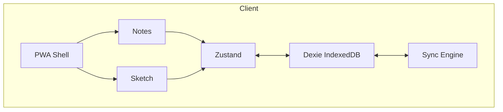

# Inkify

Offline-first notes & sketch PWA. Built with React, Vite, Tailwind CSS.

## Features

- Notes & rich text
- Freehand sketching (canvas)
- Offline-first (IndexedDB via Dexie)
- Installable PWA

## Tech Stack

| Layer | Tech |
|---|---|
| Frontend | Vite 6 + React 18 + TypeScript |
| Styling | Tailwind CSS v4 |
| PWA | vite-plugin-pwa + Workbox |
| Notes | TipTap |
| Sketch | Canvas + perfect-freehand |
| Local DB | Dexie (IndexedDB) |
| State | Zustand |

## Architecture



## Getting Started

```bash
git clone git@github.com:jaiswalkanishk07/inkified.git
cd inkified
npm install
npm run dev
```

## Scripts

```bash
npm run dev          # Dev server
npm run build        # Production build
npm run preview      # Preview build
npm run lint         # Lint
npm run typecheck    # Type check
npm run test         # Unit tests
npm run test:e2e     # E2E tests
```

## Project Structure

```
src/
├── app/              # App shell, router, entry
├── features/
│   ├── auth/         # Login, protected routes
│   ├── notes/        # Notes list & editor
│   └── sketch/       # Canvas sketching
├── core/
│   ├── db/           # Dexie schema
│   └── sync/         # Offline sync engine
├── shared/
│   ├── components/   # ErrorBoundary, Toast, etc.
│   └── styles/       # Tailwind entry
└── types/            # Shared domain types
```